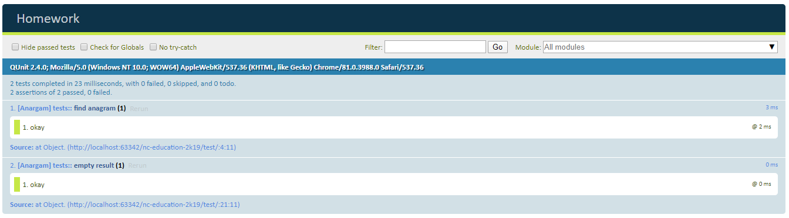

### Задание 

Напишите функцию sort, которая будет сортировать буквы в словах по алфавиту, а потом получившиеся слова в предложении — тоже. Первую букву каждого слова она сделает прописной, остальные — строчными

### Результат

Вы открыли index.html и у вас прошли тесты

